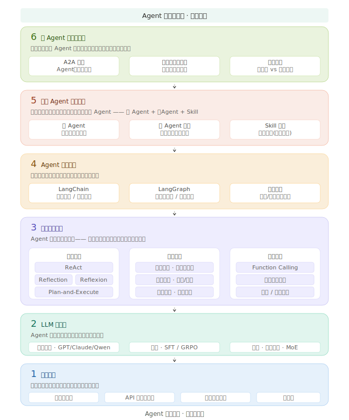

# Agent 技术全景图：从概念到落地，一张图看懂 Agent 技术栈

> 这是「Agent技术笔记」的第二篇文章，也是整个知识体系的"地图"。**建议收藏**，后续每篇文章都会标注在这张图中的位置。

---

## 📌 先说结论

Agent 技术不是单一的技术点，而是一个**多层架构的工程体系**。

从底层的 LLM 能力，到中间层的工具调用、记忆管理、决策推理，再到上层的业务 Agent 深度开发与多 Agent 协作编排——**每一层都有自己的技术挑战和最佳实践**。

这篇文章不会深入任何一个技术细节（后续会逐一展开），而是帮你建立**全局视野**：

- Agent 技术的全景长什么样
- 各部分之间怎么关联
- 你应该从哪里开始学习

---

## 🤖 Agent 的本质：基于环境变化能自主决策和执行的智能体

在进入全景图之前，先统一一个认知：

> ⚠️ **Agent ≠ 聊天机器人。**
>
> 聊天机器人是「你问，它答」——用户驱动，单轮交互。
> Agent 是「你给一个目标，它自己想办法完成」——目标驱动，多轮自主决策。

这个区别的核心在于三个方面：

| 能力 | 说明 |
|:---:|:---|
| 🔍 **感知 Perception** | 能理解任务目标和环境上下文 |
| 🧠 **推理 Reasoning** | 能自主规划步骤、做出决策 |
| ⚡ **行动 Action** | 能调用工具、执行操作、产生实际效果 |

三层能力叠加，构成 Agent 最基本的运作模型：

```
感知 → 推理 → 行动 → 观察 → 再推理 → 再行动 → ...（闭环）
```

> 💡 其中，**观察（Observation）** 是连接行动与下一轮推理的桥梁——Agent 执行行动后，必须感知环境反馈，才能做出合理的下一步决策。

---

## 🗺️ 全景图：Agent 技术的六层架构



我自己把 Agent 技术栈拆分为六个层次，**自底向上**分别是：

| 层级 | 核心内容 |
|:---|:---|
| 🚀 **第6层：多Agent协作与编排** | A2A架构 / 任务分解 / 协议设计 |
| 🎯 **第5层：业务Agent深度开发** | 子Agent调度 / Skill编排 / 深度优化 |
| 🏗️ **第4层：Agent系统框架** | LangGraph / LangChain / 自研框架 |
| 🧠 **第3层：核心能力模块** | 决策推理 / 记忆管理 / 工具调用 |
| ⚡ **第2层：LLM 能力层** | 基座模型 / 微调 / 评测 |
| 📦 **第1层：基础设施** | 向量数据库 / API网关 / 监控可观测 |

下面逐层展开。

---

### 📦 第1层：基础设施

这是**最容易忽视、但又最影响系统稳定性**的部分。

**核心组件：**

- **向量数据库**：用于语义检索和记忆存储（Milvus、Pinecone、Chroma）
- **API 网关与限流**：LLM 调用的统一入口，负责负载均衡、熔断、计费
- **监控与可观测**：Agent 调用链路追踪、Token 消耗统计、异常告警
- **缓存层**：相似问题缓存、Embedding 缓存，降低重复调用成本

> 💡 **实用建议**
>
> 很多团队在搭建 Agent 系统时直接跳到框架选型，忽略了基础设施的规划。结果上线后发现**成本不可控、调用链路无法追踪、问题难以排查**。先把第1层打好，后面会省很多事。

---

### ⚡ 第2层：LLM 能力层

Agent 的大脑，直接决定了整个系统的**决策质量**。

**核心内容：**

- **模型选型**：GPT-4o、Claude、Qwen、GLM 等模型在 Agent 场景的适用性对比
- **微调方法**：SFT（监督微调）用于格式化和领域知识注入；GRPO（Group Relative Policy Optimization）用于强化推理能力
- **模型评测**：如何量化评估模型在 Agent 场景的表现，而不只是看 benchmark 分数
- **成本与性能的平衡**：不同子任务使用不同等级的模型，用 MoE 思路做模型路由

> 🔍 **关键洞察**
>
> 做垂域 Agent 时，通用大模型往往是「通而不精」。通过 **SFT 注入领域知识**，再通过 **GRPO 强化推理链条**，可以显著提升 Agent 在特定场景下的表现。
>
> 但这不是万能药——微调有成本，且会牺牲一定的通用性，需要根据实际场景做 trade-off。

---

### 🧠 第3层：核心能力模块

这是 Agent 技术的「心脏」，包含了三个最核心的模块。

#### 一、决策推理模块

| 模式 | 说明 | 适用场景 |
|:---|:---|:---|
| **Plan-and-Execute** | 先制定完整计划，再逐步执行 | 复杂多步骤任务 |
| **ReAct** | 推理 → 执行 → 观察，循环往复 | 通用 Agent 决策 |
| **Reflection** | 在决策链中加入自我反思 | 需要纠错和调整策略 |
| **Reflexion** | 把失败经验存入记忆，避免重复犯错 | 需要持续自我改进 |

#### 二、记忆管理模块

记忆不是简单的「存与取」，而是一个完整的生命周期——**存什么、怎么用、何时更新**，三个环节缺一不可。

**记忆的存储（分层）：**

- 🔵 **短期记忆**：当前对话上下文窗口的管理（截断、摘要、滑动窗口）
- 🟣 **长期记忆**：跨会话的知识积累（向量存储、知识图谱、结构化数据库）
- 🟡 **工作记忆**：任务执行过程中的中间状态维护（思维链记录、子目标追踪）

**记忆的消费（如何用）：**

- 记忆检索：语义相似度 + 关键词混合检索，精准召回相关片段
- 上下文组装：将记忆片段与当前任务拼接，兼顾信息量与 token 预算
- 记忆蒸馏：压缩和提炼冗长历史记忆，避免「信息过载」

**记忆的更新（保持新鲜）：**

- 增量写入：新交互经验和知识实时沉淀
- 过期淘汰：业务规则变更时，及时标记或清除过期记忆
- 冲突合并：同一事实多条记忆出现矛盾时，进行合并或覆盖

#### 三、工具调用模块

- **函数调用（Function Calling）**：模型原生支持的工具调用能力
- **工具描述优化**：如何写好工具的 prompt，让模型准确选择和调用
- **工具组合与编排**：多个工具之间的依赖关系和调用顺序
- **错误处理与重试**：工具调用失败时的优雅降级策略

> 💡 **实用建议**
>
> 这三个模块绝非孤立：**记忆模块**提供环境上下文 → **推理模块**决定下一步动作 → **工具模块**执行并返回新观察 → 新观察再次写入记忆。三者交融，系统才能真正「活起来」。

---

### 🏗️ 第4层：Agent 框架

当你需要把上面的能力模块「组装」成一个可运行的系统时，框架就派上用场了。

**主流框架对比：**

| 维度 | LangChain | LangGraph | 自研框架 |
|:---|:---|:---|:---|
| 定位 | 通用 LLM 应用框架 | 图结构状态机框架 | 完全定制 |
| 学习曲线 | 中等 | 较陡 | 取决于复杂度 |
| 灵活性 | 高 | 很高 | 最高 |
| 生产就绪度 | 成熟 | 快速成熟中 | 需自建 |
| 适用场景 | 快速原型、简单链式调用 | 复杂状态机、条件分支 | 特殊需求、性能要求极高 |

**选择建议：**

- 快速验证想法 → **LangChain** 足够用
- 业务逻辑复杂，需要状态管理和条件分支 → **LangGraph** 是更好的选择
- 有特殊性能需求或安全要求 → 再考虑**自研**
- ⚠️ **不要为了自研而自研**，框架只是工具，解决业务问题才是目的

---

### 🎯 第5层：业务 Agent 深度开发

当前这部分属于和业务关系最为紧密的地方，以物流业务场景为例，整条业务链路比较长且复杂，涉及到各种复杂状态的管理，如何去把这些业务的知识融入到Agent里面，并保证Agent系统高效执行，这是目前所有企业都需要去重点攻克的事情。


**典型结构举例：**

> 大 Agent 作为整体目标的决策者，按职责拆分出若干子 Agent 各司其职，底层 Skill 负责具体工具执行。三层分工：**大 Agent 管目标、子 Agent 管决策、Skill 管执行**。

```
司机找货 Agent（大Agent）—— 目标：为司机推荐最优货源
├── 偏好理解 Agent（子Agent）── 分析司机历史行为和偏好
├── 路线匹配 Agent（子Agent）── 评估货源与司机位置的匹配度
├── 价格谈判 Agent（子Agent）── 协助司机与货主议价
└── Skills（工具执行层）
    ├── 货源搜索
    ├── 路线规划
    ├── 历史订单查询
    └── 价格计算
```

**必须要攻克的业务硬骨头：**

> ⚠️ **抽象分层**：必须划清界限——子 Agent 负责做选择题和填空题（决策），Skill 负责做应用题（纯粹执行）。

> ⚠️ **边界与红线（Guardrails）**：如何平衡 Agent 的自主决策权与企业的业务红线？Agent 可以自主议价，但绝不能给出跌破底线、违反合规的运价。这就需要在 Runtime 引入**强制的规则拦截层**。

---

### 🚀 第6层：多 Agent 协作与编排（未来方向）

当每个环节的大 Agent 都打磨成熟后，下一步就是让它们**跨环节协作**，实现端到端的智能化。

**核心概念：**

- **Agent-to-Agent（A2A）架构**：多个专业化大 Agent 通过协议协作，完成跨环节复杂任务
- **任务分解与流转**：将端到端业务目标拆解为各环节子目标，设计环节间信息流转机制
- **通信协议**：Agent 之间的消息格式、交互流程、错误处理
- **编排策略**：中心化编排（一个调度 Agent 统一管理）vs 去中心化协作（Agent 之间直接通信）

**典型场景：**

- 供需匹配环节的 Agent 完成匹配后，通过协议将结果流转给下游履约环节的 Agent
- 履约环节的 Agent 接收任务并开始跟踪，异常时主动通知上游相关 Agent 触发协同处理
- 整条链路中，每个 Agent 只感知与自己直接协作的上下游，无需了解全局流程

**关键挑战：**

- 如何定义 Agent 之间的**责任边界**，避免互相推诿或重复劳动
- 如何设计**通信协议**，保证跨环节信息传递的准确性和效率
- 如何处理 Agent 执行失败，保证端到端系统的**容错性**
- 如何评估多 Agent 系统的**整体表现**，而不只是单个 Agent 的表现

---

## 📖 学习路径建议

如果你刚开始接触 Agent 技术，我建议按以下顺序学习：

**第1阶段（入门）：理解概念**

- 读这篇全景图 + 了解 Agent以及大模型 基本原理
- 用 LangChain 写一个最简单的工具调用 Agent
- 🎯 目标：能说清楚 Agent 和普通 LLM 调用的区别

**第2阶段（进阶）：核心模块实践**

- 深入 ReAct / Reflection / Plan-and-Execute 的实现细节
- 搭建 Memory 模块，理解短期/长期/工作记忆的不同实现方式
- 学习 Function Calling 的 prompt 工程技巧
- 🎯 目标：能独立搭建一个单 Agent 系统，完成有明确步骤的任务

**第3阶段（实战）：框架选型与工程化**

- 用 LangGraph 搭建有状态管理的 Agent
- 学习 Agent 评测方法，建立自己的评测体系
- 实践垂域模型微调（SFT + GRPO）
- 🎯 目标：搭出一套「能上线、能追踪、出了问题知道怎么查」的 Agent 工程底座

**第4阶段（深入）：业务 Agent 深度开发**

- 在一个具体业务环节中，设计包含子 Agent 和 Skill 的大 Agent
- 实践子 Agent 的协作逻辑与 Skill 的编排调度
- 深入垂域场景，打磨 Agent 在单环节内的专业度和深度
- 🎯 目标：让 Agent 真正「懂业务」——在一个垂直环节内，比人工规则处理得更准、覆盖得更全

**第5阶段（前沿）：多 Agent 协作**

- 理解 A2A 架构的设计模式
- 实践跨环节的任务分解与 Agent 编排
- 学习多 Agent 系统的评测与优化
- 🎯 目标：能设计并实现复杂的多 Agent 协作系统

---

## 📢 后续文章预告

这张全景图就是本公众号的内容地图。后续文章会逐一展开每一层的核心内容，但**不会严格按第1层→第6层的顺序来写**。

后续文章大的推进思路是：**先第3层核心能力（最关键），再第4层框架（动手实践），然后第2层和第1层（工程补课），最后第5层和第6层（业务进阶），中间会穿插讲述不同层的内容，不会完全按照所述顺序**。

- **提前预知**：《ReAct 深度解析》、《Memory 模块设计》、《LangGraph 实战》、《Agent 评测体系建设》...

每篇文章我都会在标题中标注它在全景图中的位置，方便你建立系统化的认知。

> 💡 **为什么不自底向上？**
>
> 全景图的六层架构是技术栈的逻辑分层，但学习顺序和写作顺序不必完全一致。就像你学编程不会先啃操作系统原理再写 Hello World——**先理解最核心的决策机制，再向外扩展到记忆、工具、框架、基础设施**，是一条更符合认知规律的路，也便于去掌握。
---

*如果你觉得这篇文章有帮助，欢迎转发给可能需要的朋友。有任何问题或想聊的话题，随时在后台留言。*
