# LangGraph学习笔记

# **1.智能体相关概念**

## **1.1 AI智能体的概念**

AI智能体：  **自主感知环境**、**规划与决策**，并最终**执行行动**的智能 System

[](https://alidocs.dingtalk.com/core/api/resources/img/5eecdaf48460cde5c99051e8f815c8750c79de0a659dd85e75b8339e1c4c24835f261a92bdbadf9139e8703ac5556d0d4ca733db4a023d6a9150a6f4204bd1b744ebff0442fec20fdceac14957e99004014c8c291c10cfebaa575c5461c2ac1a?tmpCode=7bf83ee6-44e8-492c-a57d-8601cf939a6a)

### **1.1.1 核心能力**

- **A.规划：“认知引擎”**
    - 理解问题
    - 拆解任务
    - 制定计划
    - 动态调整
- **B.工具使用：“外延手臂”**
    - 熟悉管理工具集
    - 基于特定任务队工具进行选择
    - 对工具的整合编排
    - 持续学习新工具
- **C.行动执行**
    - **精准  且 系统** 执行已规划的操作
    - 对执行的进度和结果进行**实时监控**
    - 对 **异常和意外**  情况的  稳健处理
    - 系统 **收集** 并 **分析** 执行反馈
- D.记忆管理：上下文与持续学习的“知识库”
    - 对 历史交互数据  **持久存储**
    - **累积**领域知识与经验性学习
    - 在长期交互中   **建立 并  维护**  上下文理解

### 1.1.2运作机制

<aside>
💡

基于迭代式的“**感知-思考-行动**”完整循环，高效完成任务并达到预设目标。

需要在 自然语言理解、上下文追踪、意图识别等方面具备较强的能力。

用户          AI智能体        运行环境          记忆系统

</aside>

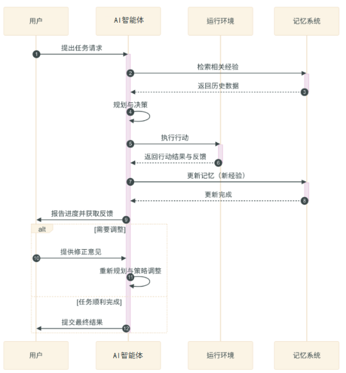

<aside>
💡

**状态管理：**内部维护一个完整的视图，包括自身内部状态、与外部环境交互的数据以及已经分配任务的发展进度等多维度信息。

**反馈处理机制：**基于每一次处理的结果，进行分析，转化成经验纳入自身的学习和改进循环中。

**错误处理**：

**学习与优化机制：**通过持续汇总分析过往的成功和失败案例，做出更为有效、更有水平的决策，逐步提升总体性能；

</aside>

## 1.2ReAct设计模式（Reason  + Act）

<aside>
💡

推理 + 行动   替代 传统AI里面的   纯粹性行动

</aside>

### 1.2.1ReAct的机制：迭代执行循环

<aside>
💡

规则—行动—观察—评估与决策

ReAct的执行循环流程图：

**Plan** → Act → Observe → Evaluate → **Plan**

</aside>

- **规划（Plan）**
    
    <aside>
    💡
    
    涉及到：
    
    - 用户请求/目标的理解
    - 信息加工
    - 计划制定
    - 选择工具
    - 证明行动合理性多个步骤。
    </aside>
    
- 行动（Act）
    
    <aside>
    💡
    
    - 选择待执行的特定行动
    - 格式化并执行行动
    - 等待完成
    </aside>
    
- 观察
    
    <aside>
    💡
    
    - 接收行动的输出
    - 解析和解释观察结果
    - 将观察结果整合到记忆中
    </aside>
    
- 评估与决策
    
    <aside>
    💡
    
    - 评估先前行动的成功程度
    - 识别错误/意外结果
    - 更新内部状态和信念
    - 决定下一步的行动
    - 生成推理轨迹
    </aside>
    

### 1.2.2提示词的构成

<aside>
💡

- 任务描述
- 少样本示例
</aside>

### 1.2.3衍生设计模式

- Plan-and-Execute设计模式
    
    <aside>
    💡
    
    - 相比于常规ReAct里面，这里的规划阶段会独立出来，使用更高级的规划算法
    </aside>
    
- Reflexion框架
    
    <aside>
    💡
    
    - 引入了“反思”机制：总结 + 指导
    </aside>
    
- 基于工具的语言模型
    
    <aside>
    💡
    
    </aside>
    

## 1.3AI智能体开发的技术和挑战

### 1.3.1现状

- 自然语言交互和理解
- 工具使用和集成
- 规划和决策能力
- 记忆和上下文管理

### 1.3.2障碍

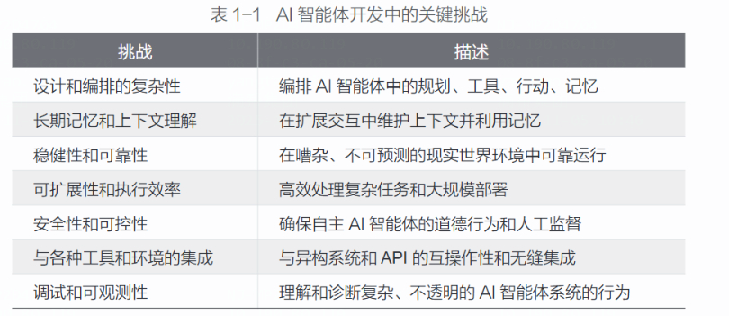

- 设计和编排的复杂性
    
    <aside>
    💡
    
    复杂的推理过程  和  动态交互模式， 需要  强大的  **软件工程规范**和**专用开发工具  确保AI智能体系统的可维护性和开发效率**
    
    </aside>
    
- 长期记忆和上下文理解
    
    <aside>
    💡
    
    - 存储和检索  关键信息
    - 捕获上下文和意图之间的差异
    
    灾难性遗忘、信息过载；
    
    关键在于  设计最高效的**记忆存储仓** 和  **记忆读取、信息整合链路**
    
    </aside>
    
- 稳健性和可靠性
    
    <aside>
    💡
    
    - 错误处理机制
    - 验证策略
    - 弹性技术
    </aside>
    
- 可扩展性和执行效率
    
    <aside>
    💡
    
    - 单任务处理能力的纵向扩展
    - 分布式计算技术的创新应用
    - 系统层面的横向扩展能力
    </aside>
    
- 安全性和可控性
    
    <aside>
    💡
    
    </aside>
    
- 与各种工具和环境的集成
- 调试和可观测性

### 1.3.3 智能体框架的必要性：LangGraph和前进之路

- 通过抽象层级简化复杂性
    
    <aside>
    💡
    
    - **高级抽象层级**，封装了智能体架构和编排的复杂细节
    - 开发者专注于  核心逻辑和行为
    </aside>
    
- 增强模块化和可重用性
    
    <aside>
    💡
    
    - 构建工具、记忆模块、规划、执行组件
    - 
    </aside>
    
- 促进稳健性和可靠性
    
    <aside>
    💡
    
    - 错误处理、监控、日志记录的内置机制
    - **调试智能体行为**、**跟踪执行流程**和**识别**潜在问题的工具
    </aside>
    
- 提高可扩展性和效率
    
    <aside>
    💡
    
    - 用于分布式智能体执行、异步任务处理和优化资料利用率的功能
    </aside>
    
- 促进可观测性和可调试性
    
    <aside>
    💡
    
    - 日志记录、跟踪机制、可视化工具、调试界面
    </aside>
    

# 2.LangGraph框架概览

## 2.1简介

### 2.1.1节点

- LLM调用节点
    
    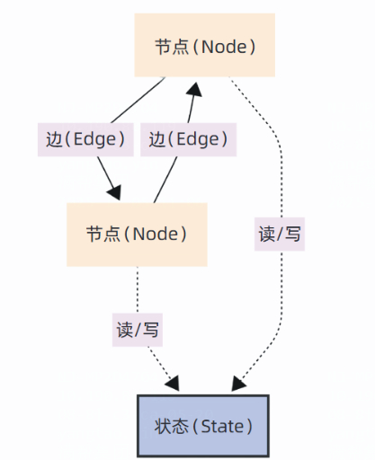
    
    <aside>
    💡
    
    - 负责与大语言模型进行交互
    </aside>
    
- 工具调用节点
    
    <aside>
    💡
    
    - Tool Call Node 允许调用各种外部工具货主API
    </aside>
    
- 自定义函数节点
    
    <aside>
    💡
    
    - 集成自定义的业务逻辑或数据处理逻辑
    </aside>
    
- 子图节点
    
    <aside>
    💡
    
    - 允许将  相关节点和便  封装成一个 子图，主图中可以将这个子图作为一个节点使用，可以嵌套
    </aside>
    

### 2.1.2边

<aside>
💡

- 定义了节点之间的连接和数据流向，决定了执行顺序和逻辑。
</aside>

- 普通边
    
    <aside>
    💡
    
    用于构建线性的工作流 
    
    A→B
    
    </aside>
    
- 条件边
    
    <aside>
    💡
    
    - 节点→路由函数→
    </aside>
    
- 入口点
- 条件入口点
    
    <aside>
    💡
    
    - 基于初始状态 和 路由函数  确定工作流程的起始执行节点
    </aside>
    

### 2.1.3状态

<aside>
💡

- StateGraph是核心图管理类。
- 实例化StateGraph，必须预定义  **状态的**   数据结构
    - 上下文信息存储
    - 节点间数据传递
    - 状态持久化
    - 多智能体共享
</aside>

<aside>
💡

虽然状态结构支持任意 Python 对象，但为了提高代码的质量和可维护性，通常建议使用 TypedDict 或 Pydantic BaseModel 来进行明确定义。**TypedDict 提供了类型注解的功能**，可以定义状态中包含的字段名称和数据类型。**Pydantic BaseModel 则提供了更强大的数据验证、序列化 / 反序列化功能**，可以定义默认值、数据约束、自定
义校验逻辑等。

</aside>

- **Examples**
    - 定义状态
        
        ```python
        from typing import Dict, Any, List, Annotated
        from typing_extensions import TypedDict
        from langgraph.graph import StateGraph, END
        import operator
        
        # 1. 使用 TypedDict 定义状态的结构。
        # 在 LangGraph 新版本中，推荐使用 TypedDict 来定义状态。
        class GraphState(TypedDict):
            # 用户输入的问题
            question: str
            # 用于存储对话历史
            chat_history: List[Dict[str, str]]
            # 模型生成的回答
            answer: str
            # 一个标志位，用于路由逻辑（例如，判断用户是否想听笑话）
            should_tell_joke: bool
        ```
        
    - 实例化
        
        ```python
        # 2. 实例化图，并传入我们定义的状态结构
        graph_builder = StateGraph(GraphState)
        ```
        
    - 添加节点
        
        ```python
        # 定义一个节点函数：判断用户意图
        def route_question(state: GraphState) -> GraphState:
            """
            根据用户问题，判断是否应该讲笑话。
            更新状态中的 ‘should_tell_joke’ 字段。
            """
            question = state[“question”].lower()
            
            # 简单的关键字匹配逻辑
            if ‘笑话’ in question or ‘搞笑’ in question or ‘joke’ in question:
                return {“should_tell_joke”: True}
            else:
                return {“should_tell_joke”: False}
        
        # 定义一个节点函数：普通聊天
        def call_model(state: GraphState) -> GraphState:
            """
            调用大模型进行普通聊天。
            """
            # 这里应该是真实的模型调用，例如调用 OpenAI 或 Ollama
            # 此处用伪代码代替
            fake_model_response = f“这是一个对问题 ‘{state['question']}’ 的普通回答。”
            
            # 更新状态中的 ‘answer’ 字段
            return {“answer”: fake_model_response}
        
        # 定义一个节点函数：讲笑话
        def tell_joke(state: GraphState) -> GraphState:
            """
            调用大模型讲一个笑话。
            """
            # 这里应该是真实的模型调用
            fake_joke = “为什么程序员分不清万圣节和圣诞节？因为 Oct 31 == Dec 25！”
            
            # 更新状态
            return {“answer”: fake_joke}
        
        # 定义一个节点函数：更新对话历史
        def update_chat_history(state: GraphState) -> GraphState:
            """
            将本轮问答更新到对话历史中。
            """
            new_history = {
                “user”: state[“question”],
                “assistant”: state[“answer”]
            }
            
            # 注意：这里我们追加到已有的 chat_history 中
            # 如果 chat_history 不存在，则初始化为空列表再追加
            current_history = state.get(“chat_history”, [])
            updated_history = current_history + [new_history]
            
            return {“chat_history”: updated_history}
        
        # 3. 将节点添加到图中
        graph_builder.add_node(“route_question”, route_question)
        graph_builder.add_node(“call_model”, call_model)
        graph_builder.add_node(“tell_joke”, tell_joke)
        graph_builder.add_node(“update_history”, update_chat_history)
        ```
        
    - 定义边和条件路由
        
        ```python
        # 4. 设置入口点。工作流从 ‘route_question’ 节点开始。
        graph_builder.set_entry_point(“route_question”)
        
        # 5. 从 ‘route_question’ 节点出发，根据条件决定下一步
        graph_builder.add_conditional_edges(
            “route_question”, # 源节点
            # 条件判断函数：检查状态中的 ‘should_tell_joke’ 字段
            lambda state: “tell_joke” if state[“should_tell_joke”] else “call_model”,
            # 可能的目标节点
            {
                “tell_joke”: “tell_joke”,
                “call_model”: “call_model”
            }
        )
        
        # 6. 无论从哪个路径（call_model 或 tell_joke）过来，都连接到 update_history 节点
        graph_builder.add_edge(“call_model”, “update_history”)
        graph_builder.add_edge(“tell_joke”, “update_history”)
        
        # 7. 更新完历史后，工作流结束
        graph_builder.add_edge(“update_history”, END)
        ```
        
    - 编译和运行
        
        ```python
        # 编译图，得到可执行对象
        graph = graph_builder.compile()
        
        # 准备初始状态，必须符合 GraphState 的结构
        initial_state: GraphState = {
            “question”: “给我讲个笑话吧！”,
            “chat_history”: [], # 初始历史为空
            “answer”: “”,
            “should_tell_joke”: False # 初始值，会被节点覆盖
        }
        
        # 运行图
        final_state = graph.invoke(initial_state)
        print(“最终回答：”, final_state[“answer”])
        print(“对话历史：”, final_state[“chat_history”])
        ```
        

## 2.2LangGraph和LangChain的关系

<aside>
💡

- LangChain—基于**有向无环图** 架构（DAG:Directed Acyclic Graph)
- LangGraph—**有向循环图** 架构(DCG:Directed Cyclic Graph)
    - 可完全独立于LangChain
</aside>

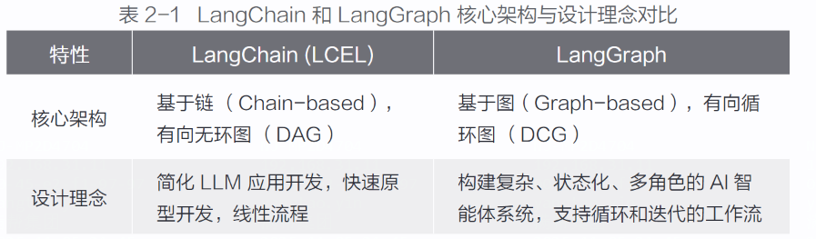

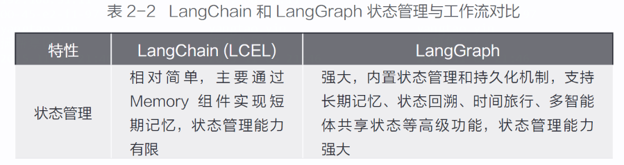

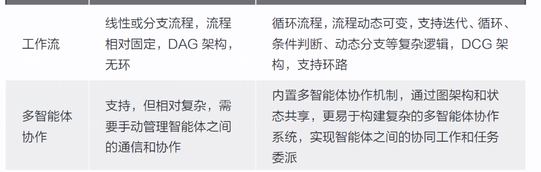

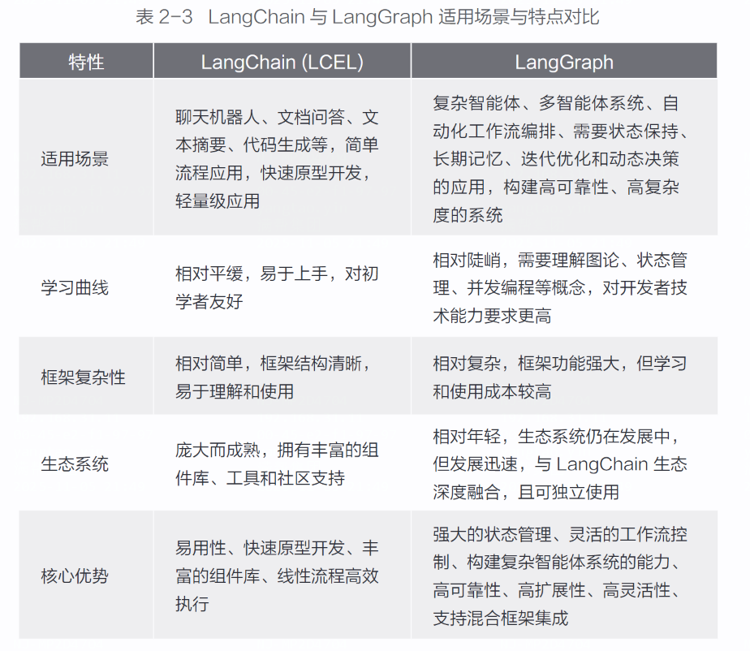

## 2.3基于LangGraph实现ReAct设计模式

<aside>
💡

构建   可以使用搜索工具  查询 天气信息的  智能体

</aside>

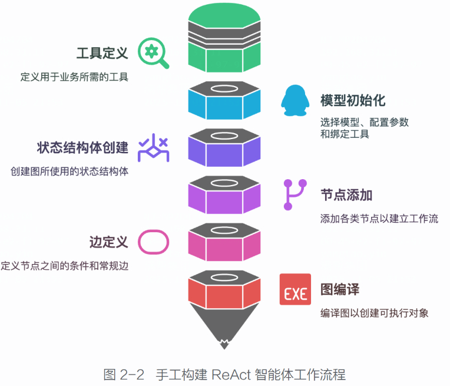

- 环境配置
    - 安装包
    
    ```bash
    pip install langgraph langchain-openai
    ```
    
    - 配置API Key
        
        ```bash
        export OPENAI_API_KEY="Your API key"
        export OPENAI_API_BASE="SiliconCloud platform API access address"
        ```
        
        or
        
        ```python
        import os, getpass
        def _set_env(var: str):
        if not os.environ.get(var):
        os.environ[var] = getpass.getpass(f"{var}: ")
        _set_env("OPENAI_API_KEY")
        _set_env("OPENAI_API_BASE")
        ```
        
        or
        
        ```bash
        pip install python-dotenv
        ```
        
        - 创建.env文件，并添加
            
            ```bash
            OPENAI_API_KEY= 您的 API KEY
            OPENAI_API_BASE=SiliconCloud 平台 API 的接入地址
            ```
            
            ```python
            from dotenv import load_dotenv
            # 加载 .env 文件中的环境变量，请确保 .env 文件位于当前工作目录下
            load_dotenv()
            ```
            
- 定义工具和工具节点
    
    ```python
    from typing import Literal # 导入 Literal，用于类型提示
    from langchain_openai import ChatOpenAI
    from langchain_core.tools import tool # 导入 tool 装饰器，用于定义工具
    from langgraph.graph import END, START, StateGraph, MessageState #
    导入 LangGraph 图构建核心组件：END、START、StateGraph、MessageState
    from langgraph.prebuilt import ToolNode # 导入 ToolNode，用于封装工具
    节点
    # 定义工具 search，用于模拟网页搜索功能，查询城市的天气信息
    @tool
    def search(query: str):
    """ 设计网页搜索工具 """
    # 这是一个占位符工具，实际应用中需要替换为真正的搜索功能
    if "sf" in query.lower() or "san francisco" in query.lower():
    return "It's 16 degrees and foggy."
    return "It's 32 degrees and sunny."
    tools = [search] # 将 search 工具放入工具列表
    tool_node = ToolNode(tools) # 创建 ToolNode，将工具列表封装成 LangGraph
    节点
    
    ```
    
- 初始化语言模型并绑定工具
    
    ```python
    # 初始化语言模型，使用 Qwen/Qwen2.5-7B-Instruct 模型，并绑定工具
    model = ChatOpenAI(model="Qwen/Qwen2.5-7B-Instruct", temperature=0).
    bind_tools(tools)
    ```
    
    <aside>
    💡
    
    这里 **bind_tools(tools) 方法**至关重要。它将我们定义的工具列表 tools 绑定到ChatOpenAI 上，使该对话模型对象知道它可以使用哪些工具，以及如何调用这些工具。
    
    </aside>
    
- 创建状态结构体
    
    ```python
    # 定义状态类型为 MessageState，用于处理消息列表
    workflow = StateGraph(MessageState)
    ```
    
- 添加agent节点
    
    ```python
    Python
    # 定义 agent 节点的执行函数：call_model
    def call_model(state):
    		messages = state['messages'] # 从状态中获取消息列表
    		response = model.invoke(messages) # 调用语言模型 model 进行推理，输
    		入为消息列表
    		return {"messages": [response]} # 将模型响应消息封装成字典返回，键为
    messages，值为包含响应消息的列表
    # 将 call_model 函数添加到图中，并命名为 agent 节点
    workflow.add_node("agent", call_model)
    ```
    
    <aside>
    💡
    
    **添加 agent 节点时**，要定义一个 **Python 函数 call_model** 作为 agent 节点的执行函数。call_model 函数接收当前的状态 state 作为输入，调用语言模型 model 进行推理，并将模型的响应消息添加到状态中。
    
    </aside>
    
- 添加tools节点
    
    ```python
    # 将之前创建的 tool_node 实例添加到图中，并命名为 tools 节点
    workflow.add_node("tools", tool_node)
    ```
    
- 设置图的入口点
    
    ```python
    # 设置图的入口点为 agent 节点，表示工作流从该节点开始执行
    workflow.set_entry_point("agent")
    ```
    

<aside>
💡

然后，我们需要定义节点之间的边。在本例中，我们需要定义三种类型的边。
（1）从 agent 节点到 tools 节点的条件边：当 agent 节点的响应消息中包含工具调用指令时，工作流需要流向 tools 节点，执行工具调用。我们需要定义一**个条件判断函数 should_continue 来决定是否继续执行工具调用**。
（2）从 agent 节点到 END 的条件边：当 agent 节点的响应消息中不包含工具调用指令时，表示智能体已经生成了最终回复，工作流应该结束。我们需要在 should_continue 函数中判断这种情况，并返回 END，表示工作流结束。
（3）从 **tools 节点到 agent 节点的普通边**：当 tools 节点执行完工具调用后，工作流应该返回到 agent 节点，让大语言模型根据工具调用的结果，决定下一步的行动（是再次调用工具，还是生成最终回复）。

</aside>

- 定义条件判断函数
    
    ```python
    # 定义条件判断函数 should_continue，决定下一步执行哪个节点
    def should_continue(state):
    		messages = state['messages'] # 从状态中获取消息列表
    		last_message = messages[-1] # 获取最后一条消息，即 agent 节点的输出消息
    		# 如果 agent 节点的输出消息中包含工具调用指令，则流向 tools 节点
    		if last_message.tool_calls:
    				return "tools"
    		# 否则，工作流结束，流向 END
    		return END
    ```
    
- 添加条件边
    
    ```python
    # 添加条件边：从 agent 节点出发，根据 should_continue 函数的返回值，决定流向
    tools 节点或 END
    workflow.add_conditional_edges(
    agent, # 起始节点为 agent 节点
    should_continue # 条件判断函数为 should_continue
    )
    
    ```
    
    <aside>
    💡
    
    workflow.add_conditional_edges("agent", should_continue) 方法添加了一条从 agent节点出发的条件边，并指定 should_continue 函数作为条件判断函数。LangGraph 会在agent 节点执行完成后，调用should_continue 函数，根据其返回值来决定下一步工作流的走向。
    
    </aside>
    
- 添加普通边
    
    ```python
    # 添加普通边：从 tools 节点到 agent 节点，表示工具调用完成后，总是返回 agent
    节点继续推理
    workflow.add_edge("tools", "agent")
    ```
    
- 编译图
    
    ```python
    # 编译图，得到可执行的 app 对象
    app = workflow.compile()
    
    # 运行智能体应用 App，处理用户查询
    final_state = app.invoke({"messages": [{"role": "user", "content":
    "What is the weather in San Francisco"}]})
    # 打印智能体的最后一条回复消息的内容
    print(final_state["messages"][-1].content)
    ```
    
- invoke过程详解
    
    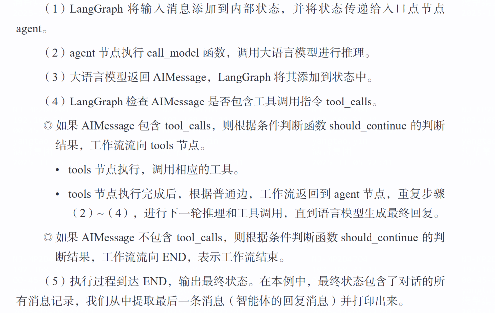
    

# 3.LangGraph的状态图结构

## 3.1核心原语

### 3.1.1状态

<aside>
💡

状态是贯穿智能体系统运行始终的核心概念。我们可以将其理解为智能体的“短期记忆”、“工作记忆”或者“临时共享数据空间”，它承载着智能体在执行过程中产生的各种信息，包括用户输入、中间结果、工具输出、对话历史等

</aside>

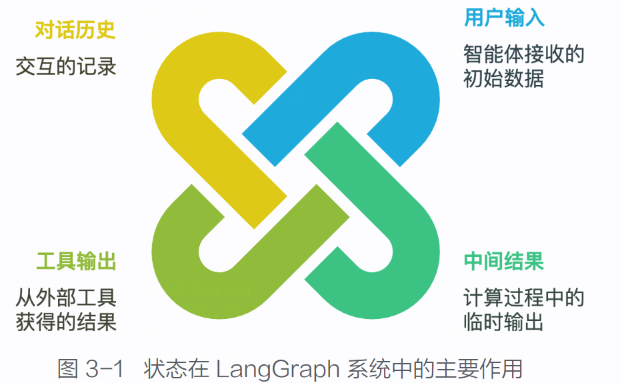

- 使用TypedDictState 和 PydanticState 定义状态
    
    <aside>
    💡
    
     typing.TypedDict 定义具有类型提示的字典结构状态；
    
    dataclasses 或者 Pydantic 来定义状态模型, Pydantic，它**支持运行时数据验证，能确保状态的类型和取值符合预期**
    
    </aside>
    
    ```python
    from typing_extensions import TypedDict
    from pydantic import BaseModel,field_validator
    # 使用 TypedDict 定义状态
    class TypedDictState(TypedDict):
    			user_input: str
    			agent_response: str
    			tool_output: str
    # 使用 Pydantic 定义状态，并进行数据验证
    from pydantic import BaseModel,field_validator
    class PydanticState(BaseModel):
    			user_input: str
    			agent_response: str
    			tool_output: str
    			mood: str = "neutral" # 默认情绪状态为 neutral
    			@field_validator('mood')
    			@classmethod
    			def validate_mood(cls, value):
    						if value not in ["happy", "sad", "neutral"]:
    									raise ValueError(" 情绪状态必须是 'happy', 'sad' 或
    						'neutral"')
    						return value
    ```
    
- 私有状态和公共状态
    
    ```python
    from typing _extensions import TypedDict
    #定义全局的公共状态结构体Schema
    class OverallState(TypeDict):
          user_input:str
          agent_response:str
          
    class ToolState(TypedDict):
            api_key:str
            tool_config:dict   
    ```
    
    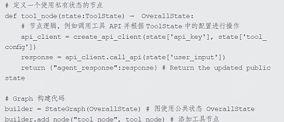
    
- 输入/输出 结构体
    
    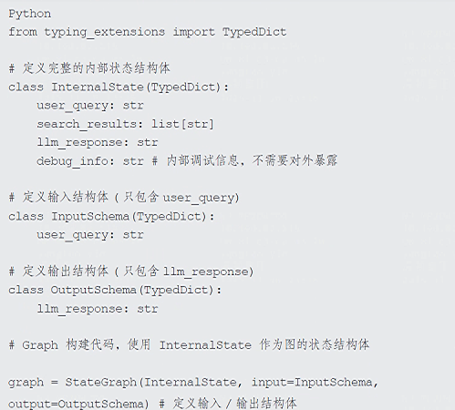
    
    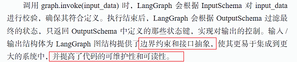
    
- 状态归约器
    
    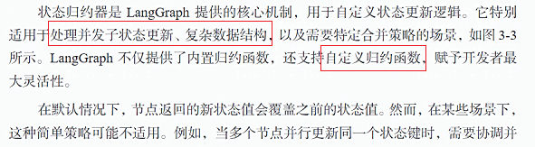
    
    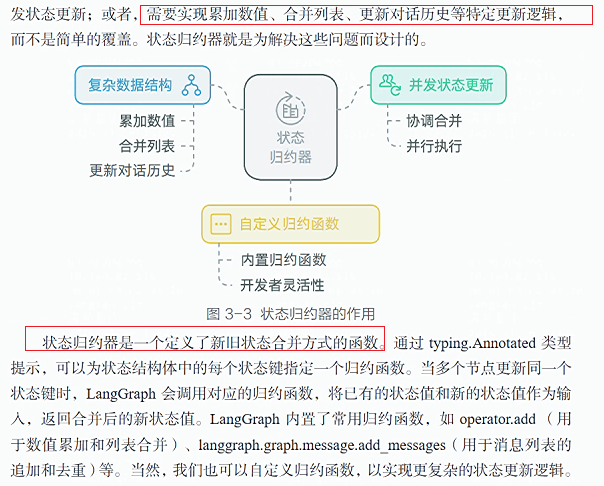
    
    - 使用状态归约器
        
        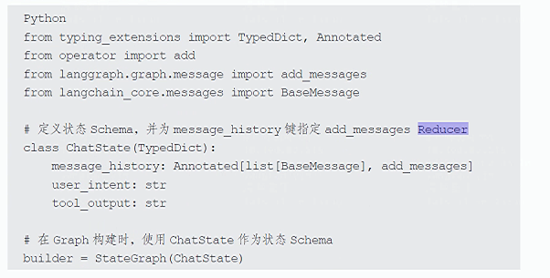
        
    - 自定义归约函数
        
        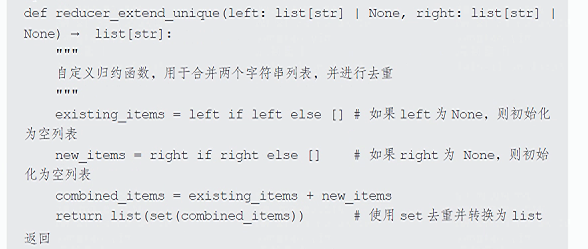
        
    - 状态结构体中，应用自定义规约函数
        
        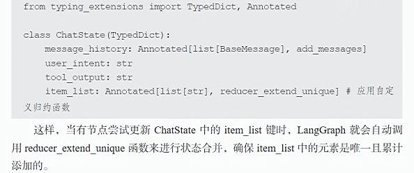
        
- Message 与 MessageState
    
    ```python
    Python
    from langgraph.graph import MessageState
    class MyChatState(MessageState):
    			"""
    			自定义的 ChatState， 继承自 MessageState,
    			自动包含 messages 状态键和 add_messages Reducer
    			"""
    			user_intent: str
    			tool_output: str
    			# 可以添加其他自定义的状态键
    ```
    
    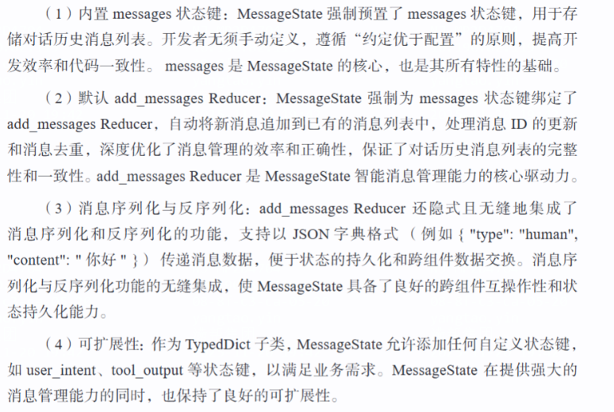
    
- trim_messages 和 RemoveMessage 在消息状态管理中的应用
    
    （1）trim_messages：该函数主要用于限制消息列表中词元（Token）的总长度，防止对话历史无限增长导致 LLM 处理效率降低和成本增加。
    
    ```python
    Python
    from langchain_core.messages import trim_messages
    from langgraph.graph import MessageState
    def llm_node(state: MessageState):
    				message_history = state['messages'] # 直接从 MessageState 中获取消
    				息列表
    				trimmed_messages = trim_messages(
    				message_history,
    				max_tokens=1000,
    				strategy="last",
    				token_counter=ChatOpenAI(model="gpt-4o"),
    				allow_partial=False
    				)
    				llm_response = llm.invoke(trimmed_messages)
    				return {"messages": [llm_response]} # 将 LLM 响应添加到消息历史 (通
    过 add_messages Reducer)
    
    ```
    
    2）RemoveMessage：更准确地说，filter_messages 是基于 RemoveMessage 和add_messages Reducer 的消息过滤机制，它提供了一种更灵活、更精细的对话历史管
    理方式。
    
    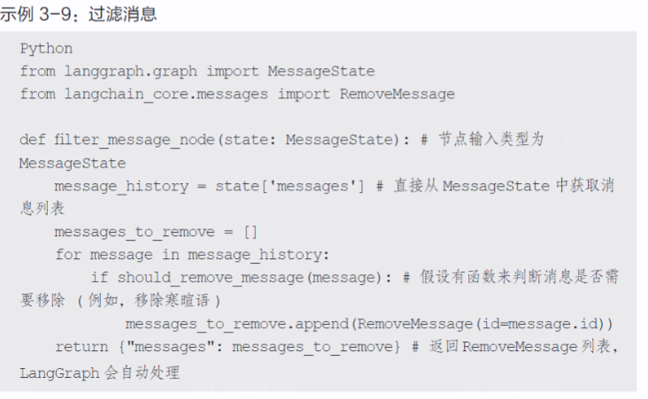
    

### 3.1.2节点

<aside>
💡

点是 LangGraph 图结构中的基本计算单元。每一个节点都封装了一个独立的执行逻辑，例如调用语言模型、执行工具、进行条件判断，或者仅仅是一个简单的数据处理函数。你可以将节点视为 AI 智能体系统中的“执行器”，它们负责完成具体
的任务，并驱动着整个 AI 智能体的运转。
在 LangGraph 中，节点**本质上就是一个 Python 函数。**这个函数**接收当前的状态
作为输入，并返回一个新的状态（或者状态的更新部分）作为输出**。这种函数式的设
计使节点具有良好的可测试性和可复用性，同时让 LangGraph 图结构的定义更加清
晰和简洁。

</aside>

```python
def my_node(state):
# 从状态中读取数据
input_data = state.get("some_key")
# 执行节点执行逻辑 ( 例如调用 LLM、工具等 )
output_data = process_data(input_data)
# 返回新的状态（或状态的更新部分）
return {"some_key": output_data, "another_key": new_value}
```

<aside>
💡

值得注意的是，节点函数不一定要返回完整的状态对象，**可以只返回需要更新的状态键值对。**LangGraph 会**自动将节点**返回的**更新部分合并到当前状态中**。例如，若状态包含了 user_input、 agent_response 和 tool_output 三个键，而某个节点只需要更新 agent_response，则该节点函数只需要返回 {"agent_response": new_response} 即可。
LangGraph 会自动将 new_response 更新到状态的 agent_response 键，而 user_input 和tool_output 键的值则保持不变

</aside>

- 包含大模型处理的节点定义
    
    ```python
    from langgraph.graph import StateGraph, START, END, MessageState
    from langchain_core.prompts import ChatPromptTemplate
    from langchain_openai import ChatOpenAI
    # 定义状态结构体
    class ChatState(MessageState): # 使用 ChatState 替代原有的 State，并继承
    自 MessageState
    		user_question: str # 保留 user_question 状态键
    		llm_response: str # 保留 llm_response 状态键
    		# 定义 LLM 节点
    		def llm_node(state):
    		prompt = ChatPromptTemplate.from_messages([
    		("human", "{question}")
    		])
    		model = ChatOpenAI(model="Qwen/Qwen2.5-7B-Instruct")
    		chain = prompt | model
    		response = chain.invoke({"question": state['user_question']}).
    		content
    		return {"llm_response": response}
    # 构建图
    builder = StateGraph(ChatState) # 使用 ChatState 替代原有的 State
    builder.add_node("llm_node", llm_node)
    builder.add_edge(START, "llm_node")
    builder.add_edge("llm_node", END)
    graph = builder.compile()
    # 调用图
    result = graph.invoke({"user_question": " 你好，LangGraph ！ "})
    print(result)
    ```
    
- 节点配置   重试策略
    
    ```python
    import operator
    import sqlite3
    from typing import Annotated, Sequence
    from typing_extensions import TypedDict
    from langchain_openai import ChatOpenAI
    from langchain_community.utilities import SQLDatabase
    from langchain_core.messages import AIMessage, BaseMessage
    from langgraph.graph import StateGraph, START, END
    from langgraph.types import RetryPolicy # 导入 RetryPolicy 类
    # 定义数据库和模型
    db = SQLDatabase.from_uri("sqlite:///:memory:")
    model = ChatOpenAI(model="Qwen/Qwen2.5-7B-Instruct")
    # 定义图的状态和逻辑节点
    class AgentState(TypedDict):
    		messages: Annotated[Sequence[BaseMessage], operator.add]
    def query_database(state):
    		query_result = db.run("SELECT * FROM Artist LIMIT 10;")
    		return {"messages": [AIMessage(content=query_result)]}
    def call_model(state):
    		response = model.invoke(state["messages"]
    		return {"messages": [response]}
    # 定义图 builder
    builder = StateGraph(AgentState)
    # 为 query_database 节点配置重试策略：针对 sqlite3.OperationalError 异常
    进行重试
    builder.add_node(
    "query_database",
    query_database,
    retry=RetryPolicy(retry_on=sqlite3.OperationalError), # 配置
    RetryPolicy，retry_on 参数指定重试条件为 sqlite3.OperationalError 异常
    )
    # 为 model 节点配置重试策略: 最多重试 5 次 ( 默认重试条件 )
    builder.add_node(
    "model",
    call_model,
    retry=RetryPolicy(max_attempts=5), # 配置 RetryPolicy，max_
    attempts 参数指定最大重试次数为 5
    )
    builder.add_edge(START, "model")
    builder.add_edge("model", "query_database")
    builder.add_edge("query_database", END)
    graph = builder.compile(
    ```
    

### 3.1.3边

<aside>
💡

边在 LangGraph 中负责连接不同节点，定义 AI 智能体系统的执行流程。边决定了在执行完当前节点后下一步应该执行的节点，将独立的节点串联成有机整体，赋予图结构动态执行能力。LangGraph 主要支持两种类型的边：普通边和条件边。理解这两种类型边的特性及应用场景是设计复杂 LangGraph 流程的关键

- 普通边定义了节点间固定的、无条件的连接关系，用于构建线性、顺序执行流程。若需要在执行完节点 A 后总是执行节点 B，则可以用 builder.add_edge(start_node,end_node) 在节点 A 和节点 B 之间添加普通边， 其中 start_node 为起始节点，end_node 为目标节点。执行时，系统执行完 start_node 后会无条件转移到 end_node。
- 条件边提供了基于状态动态路由的能力，用于构建**分支的、非线性且动态可变**的流程。它通过条件函数定义路由逻辑：该函数接收当前状态作为输入，并根据状态内容动态返回下一步要执行的节点名称（字符串）。LangGraph 会根据返回值，使执行路径随状态变化而变化，从而构建出更智能灵活的系统。条件边使用 builder.add_conditional_edges(start_node,conditional_function) 来 定 义， 其 中 conditional_function的返回值必须是图中已定义的节点名称。
</aside>

- 意图识别以及技能路由场景
    
    ```python
    def route_to_skill(state): # 条件函数，根据用户意图路由到不同的技能节点
    		user_intent = state['user_intent']
    		if user_intent == " 查询天气 ":
    		return "weather_query_node" # 跳转到查询天气节点
    		elif user_intent == " 预订机票 ":
    		return "flight_booking_node" # 跳转到预订机票节点
    		elif user_intent == " 投诉建议 ":
    		return "complaint_suggestion_node" # 跳转到投诉建议处理节点
    		else:
    		return END # 无法识别意图，结束流程
    builder.add_conditional_edges("intent_recognition_node", route_to_
    skill) # 意图识别节点 → 技能执行节点 ( 条件边 )
    ```
    
- 工具选择与结果处理场景
    
    ```python
    def route_after_tool_selection(state): # 条件函数，根据工具选择结果路由
    			tool_name = state['selected_tool']
    			if tool_name == " 搜索引擎 ":
    			return "search_tool_node" # 跳转到搜索引擎节点
    			elif tool_name == " 计算器 ":
    			return "calculator_tool_node" # 跳转到计算器节点
    			else:
    			return END
    def route_after_tool_execution(state): # 条件函数，根据工具执行结果路由
    		tool_status = state['tool_status']
    		if tool_status == " 成功 ":
    		return "tool_result_processing_node" # 跳转到结果处理节点
    		else:
    		return "tool_error_handling_node" # 跳转到错误处理节点
    builder.add_conditional_edges("tool_selection_node", route_after_
    tool_selection) # 工具选择节点 → 工具执行节点 (条件边 )
    builder.add_conditional_edges("tool_execution_node", route_after_
    tool_execution) # 工具执行节点 → 结果/ 错误处理节点 ( 条件边 )
    ```
    

### 3.1.4命令

<aside>
💡

命令（Command）是 LangGraph 新增的强大工具，允许在单个节点中整合状态更新和流程控制逻辑。一般情况下，节点主要负责状态更新，边控制流程跳转。但在实际应用中，需要节点同时完成这两项功能。命令正是为此设计的，打破了节点和边的传统分工，赋予节点更强的流程控制能力。

- 命令是作为节点的返回值的特殊对象，主要包含以下两个部分。
（1）update：状态更新字典，功能与普通节点返回值相同。
（2）goto：流程跳转字符串，用于指定下一步执行节点。值必须是图中已定义
的节点名称。

使用命令的优势在于**将状态更新逻辑和流程控制逻辑紧密结合，使节点功能更
内聚强大**。在某些场景下，命令能**简化图结构定义，提升代码的可读性和可维护性**。

使用命令的步骤如下。
（1）从 langgraph.types 模块导入 Command。
（2）节点函数不再直接返回状态更新字典，而是创建一个 Command 对象并返回。
在创建 Command 对象时，需要通过 update 参数指定状态更新字典，通过 goto 参数
指定下一个节点的名称。
（3）为节点函数添加类型提示（Type Hint），使用 typing.Literal 指定 goto 参数
可能跳转到的节点名称列表。

```python
from langgraph.types import Command
from typing import Literal
def my_node(state) → Command[Literal["node_B", "node_C"]]:
		""" 使用 Command 的节点函数示例 """
		# 节点计算逻辑
		next_node_name = decide_next_node(state) # 根据状态决定下一个节点
		return Command(
		update={"processed_data": result_data}, # 状态更新
		goto=next_node_name # 流程跳转指令
		)
```

</aside>

<aside>
💡

（1）优先使用命令的场景：
◎节点需要同时处理状态更新和流程跳转时；
◎实现多智能体协作中的任务交接行为时；
◎需要表达“处理—交接”的完整逻辑流程时。

（2）优先使用条件边的场景：
◎流程跳转决策逻辑相对独立时；
◎节点主要职责为状态更新时；
◎需要保持“关注点分离”的设计原则时

（3）必须使用命令的场景：
◎子图节点需要跳转至父图节点时；
◎实现跨图层控制流交接时。

</aside>

## 3.2流程控制：分支与并发

<aside>
💡

在实际 AI 智能体中，线性流程有明
显局限性，例如包括：
（1）无法实现条件判断和动态路径选择。
（2）无法实现并行任务执行。例如，在一个信息检索系统中，我们可能需要同
时从多个数据源 （如网页搜索、知识库、数据库） 并行检索信息，以提高检索效率
和覆盖面。线性流程无法满足这种并行需求。
（3）执行效率较低，计算资源利用率不足。

LangGraph 通过**分支 （Branching）** 和 **并发 （Concurrency）**机制解决这些问题。
通过分支实现条件判断和动态路由；通过并发实现多任务并行执行，充分利用计算资源，提高系统性能。

</aside>

### 3.2.1 并行分支：扇出与扇入

- 扇出
    
    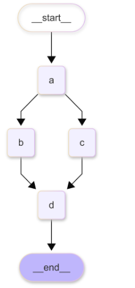
    
    实现扇出的最简单方式是为一个节点添加多个出边，将其同时连接到多个下游节点。当 LangGraph 执行到该节点时，会并发触发所有出边指向的下游节点，使流
    程从该节点并行地向多个分支扩散，形成扇出的效果
    
    ```python
    builder = StateGraph(State)
    class ReturnNodeValue: # ReturnNodeValue 节点的定义
    		def __init__(self, node_secret: str):
    				self._value = node_secret
    		def __call__(self, state: State) → Any:
    				print(f"Adding {self._value} to {state['aggregate']}")
    				return {"aggregate": [self._value]}
    # 添加节点 A、 B、 C、 D
    builder.add_node("a", ReturnNodeValue("I'm A"))
    builder.add_node("b", ReturnNodeValue("I'm B"))
    builder.add_node("c", ReturnNodeValue("I'm C"))
    builder.add_node("d", ReturnNodeValue("I'm D"))
    # 定义流程：节点 A 扇出到节点 B 和 C，节点 B 和 C 扇入到节点 D
    builder.add_edge(START, "a")
    builder.add_edge("a", "b") # 节点 A 出边 1：指向节点 B
    builder.add_edge("a", "c") # 节点 A 出边 2：指向节点 B
    builder.add_edge("b", "d") # 节点 D 入边 1：来自节点 B
    builder.add_edge("c", "d") # 节点 D 入边 2：来自节点 C
    builder.add_edge("d", END) # END 节点
    graph = builder.compile(
    ```
    
- 扇入
    
    <aside>
    💡
    
    扇入是指将多个并行分支汇聚到同一个下游节点的操作。实现扇入时，需为目标节点添加多条入边，使其能够接收多个上游节点的输入。在 LangGraph 中，当执行至扇入节点时，**系统会等待所有上游节点完成执行后，才触发该扇入节点的运行**，以此实现并行流程的同步汇合。
    
    </aside>
    
    <aside>
    💡
    
    需要注意的是，并行分支的状态管理会变得更加重要。如果**多个并行执行的节点需要更新同一个状态键**，就需要特别注意**状态更新冲突问题**。3.1.1 节介绍的**状态归约器**机制可以帮助我们安全处理并发状态更新。
    
    </aside>
    
    ```python
    import operator
    from typing import Annotated, Any
    from typing_extensions import TypedDict
    from langgraph.graph import StateGraph, START, END
    class State(TypedDict):
    		aggregate: Annotated[list, operator.add]
    def a(state: State):
    		print(f'Adding "A" to {state["aggregate"]}')
    		return {"aggregate": ["A"]}
    def b(state: State):
    		print(f'Adding "B" to {state["aggregate"]}')
    		return {"aggregate": ["B"]}
    def c(state: State):
    		print(f'Adding "C" to {state["aggregate"]}')
    		return {"aggregate": ["C"]}
    def d(state: State):
    		print(f'Adding "D" to {state["aggregate"]}')
    		return {"aggregate": ["D"]}
    builder = StateGraph(State)
    builder.add_node(a)
    builder.add_node(b)
    builder.add_node(c)
    builder.add_node(d)
    builder.add_edge(START, "a")
    builder.add_edge("a", "b")
    builder.add_edge("a", "c")
    builder.add_edge("b", "d")
    builder.add_edge("c", "d")
    builder.add_edge("d", END)
    graph = builder.compile()
    graph.invoke({"aggregate": []}, {"configurable": {"thread_id":
    "foo"}})
    ```
    
    ```python
    def b_2(state: State):
    		print(f'Adding "B_2" to {state["aggregate"]}')
    		return {"aggregate": ["B_2"]}
    builder = StateGraph(State)
    builder.add_node(a)
    builder.add_node(b)
    builder.add_node(b_2)
    builder.add_node(c)
    builder.add_node(d)
    builder.add_edge(START, "a")
    builder.add_edge("a", "b")
    builder.add_edge("a", "c")
    builder.add_edge("b", "b_2")
    builder.add_edge(["b_2", "c"], "d")
    builder.add_edge("d", END)
    graph = builder.compile()
    ```
    

### 3.2.2 并发而非并行

<aside>
💡

并发和并行的主要区别如下。
（1）**并行指同时执行多个独立的任务，**通常需要多个物理计算资源 （例如，多
核 CPU、多台机器） 真正地同时运行不同的代码，以缩短总执行时间。例如，分布
式计算框架 Apache Pregel 将任务分配到多台机器上并行执行。
（2）**并发指在单计算资源 （例如，单核 CPU）上“看似同时”执行多个任务**，通过时间片轮转或异步 I/O 实现。宏观上，多个任务“同时”运行，微观上 CPU 仍串行执行。其目的是提高系统的响应性和资源利用率，但不一定能缩短总执行时间（甚至可能因为任务切换的开销而略微增加）。

LangGraph 的并发模型**基于 Superstep （超步）的概念构建**，借鉴自 Google 的分 布 式 计 算 框 架 Pregel， 以 及 其 他 BSP Bulk Synchronous Parallel（ 计 算 模 型）

LangGraph Superstep 具有以下关键特性。
（1）并发性：**同一个 Superstep 内**的多个节点可并发执行，提升流程执行效率。
（2）同步性：**每个 Superstep 结束时，都有一个全局的同步点 （Synchronization
Barrier），保证了状态更新的原子性和一致性。**只有当 Superstep 内的所有节点都执行完成后，才会进入下一个 Superstep，这种同步机制简化了并行流程的状态管理。
（3）迭代性：LangGraph 的图执行过程是Superstep 的迭代过程。**每个 Superstep都在前一个 Superstep 的状态基础上进行计算和更新，直到满足终止条件**。这种迭代式的执行方式，使 LangGraph 能够处理复杂、多轮次的智能体工作流。

</aside>

### 3.2.3 递归限制于并行分支

<aside>
💡

递归限制（Recursion Limit）用于限制 LangGraph 图执行过程中的最大 Superstep
的迭代次数，**防止图无限循环执行，**耗尽计算资源。递归限制同样适用于并行分支流程，并且需要特别注意以下几点。
（1）**递归限制的计数单位是 Superstep**，而不是节点。无论一个 Superstep 内部
并发执行了多少个节点，都只会计为一次 Superstep 迭代。
（2）在扇出扇入流程中，并发执行的多个节点属于同一个 Superstep，整个流程
的 **Superstep 迭代次数由执行路径的深度决定**，而非并行分支的宽度。

</aside>

```python
import operator
from typing import Annotated, Any
from typing_extensions import TypedDict
from langgraph.graph import StateGraph, START, END
from langgraph.errors import GraphRecursionError # 导入
GraphRecursionError
class State(TypedDict):
		# operator.add 是状态归约器，确保状态键 aggregate 为 appendonly 列表
		aggregate: Annotated[list, operator.add]
def node_a(state):
		return {"aggregate": ["I'm A"]}
def node_b(state):
		return {"aggregate": ["I'm B"]}
def node_c(state):
		return {"aggregate": ["I'm C"]}
def node_d(state):
		return {"aggregate": ["I'm D"]}
builder = StateGraph(State)
builder.add_node("a", node_a)
builder.add_edge(START, "a")
builder.add_node("b", node_b)
builder.add_node("c", node_c)
builder.add_node("d", node_d)
builder.add_edge("a", "b")
builder.add_edge("a", "c")
builder.add_edge("b", "d")
builder.add_edge("c", "d")
builder.add_edge("d", END)
graph = builder.compile()
try:
# 设置 recursion_limit=3，少于流程正常执行所需的 Superstep 数量
		graph.invoke({"aggregate": []}, {"recursion_limit": 3})
except GraphRecursionError as e: # 捕获 GraphRecursionError 异常
		print(f"GraphRecursionError 异常被成功捕获 : {e}")
```

## 3.3 MapReduce模式：任务分解于并行处理

<aside>
💡

在构建复杂 AI 智能体系统时，经常需要处理大规模数据或执行**计算密集型任务**，如批量处理海量文档、并行生成创意文案、分布式分析用户行为数据等。传统
的线性流程往往难以胜任此类任务，效率低下且扩展性差。**MapReduce （映射—归约）模式作为经典并行计算模型，为这类问题提供了高效、可扩展的通用解决方案。**
LangGraph 框架原生支持 MapReduce 模式，可轻松构建 MapReduce 分支，充分利用并行计算的优势，提高 AI 智能体系统的数据处理能力和性能。

</aside>

### 3.3.1核心思想

<aside>
💡

MapReduce 模式的核心思想是“分而治之”，将复杂的大规模计算任务分解成两个相互协作的阶段。
（1）**Map（映射）阶段**：“分”的过程。将原始输入数据**分割成多个独立子数据集**，并将每个子数据集分配给不同的计算节点 （在 LangGraph 中，可以理解为不同的节点实例） 并行处理。每个计算节点执行相同的“映射”操作，生成中间结果 （通常是 Key-Value 键—值对形式）。Map 阶段的关键特点是“并行”和“独立”，每个子任务之间互不干扰，可以最大程度地利用并行计算资源。
（2）Reduce（归约）阶段：“治”的过程。**聚合 Map 阶段并行生成的多个中间结果，通过“归约”操作，合并成全局最终结果。**Reduce 阶段通常是一个聚合、汇总、筛选、排序的过程，将 Map 阶段的“半成品”组装成“成品”。Reduce 阶段的关键特点是**“聚合”和“归纳”，将 Map 阶段并行
处理的结果进行有效的整合和提炼**，最终得到我们需要的答案或结果。

</aside>

### 3.3.2 MapReduce实现

<aside>
💡

LangGraph 框 架 通 过 结 合 状 态、 节 点、 边 及 Send API， 实 现 了 灵 活 高 效 的MapReduce 模式。

</aside>

- 定义 Map 阶段的分割节点
    
    <aside>
    💡
    
    分割节点（Splitter Node）负责将原始输入数据分割成多个独立的、规模较小的子数据集，并动态地生成 Send 对象列表。每个 Send 对象对应一个子任务，并指定目标节点和初始状态
    
    </aside>
    
    ```python
    from langgraph.constants import Send
    def split_input_data(state: OverallState): # 分割节点函数，输入状态为
    OverallState
    		input_data = state["large_input_data"] # 从状态中获取大规模输入数据
    		sub_datasets = split_large_data(input_data, num_sub_tasks=10) #
    		将大规模数据分割成 10 个子数据集 (假设 split_large_data 函数实现了分割逻辑)
    		send_list = []
    		for sub_dataset in sub_datasets: # 遍历每个子数据集
    				send_list.append(
    				Send("map_node", {"sub_data": sub_dataset}) # 为每个子数
    				据集创建一个 Send 对象，目标节点为 map_node，子任务状态为 {"sub_data": sub_
    				dataset}
    				)
    		return send_list # 返回 Send 对象列表，用于动态路由到多个 Map 节点实例
    ```
    
- 定义 Map 阶段的映射节点
    
    <aside>
    💡
    
    射节点（Map Node）负责接收分割节点分发的子任务，并对子任务数据执行实际的 “映射” 计算，生成中间结果，映射节点独立处理子任务，不依赖其他映射节点的执行结果，输出局部中间结果，用于后续 Reduce 阶段聚合。
    
    </aside>
    
    ```python
    class MapState(TypedDict): # 定义映射节点的私有状态结构体，用于接收分割节
    点传递的子任务数据
    		sub_data: Any # 子任务数据类型可以是任意类型
    def map_node(state: MapState): # 映射节点函数，输入状态为 MapState
    		sub_data = state["sub_data"] # 从状态中获取子任务数据
    		intermediate_result = process_sub_data(sub_data) # 处理子任务数据，
    		生成中间结果 ( 假设 process_sub_data 函数实现了映射计算逻辑 )
    		return {"intermediate_result":intermediate_result} # 返回中间结果，
    		用于后续 Reduce 阶段聚合
    ```